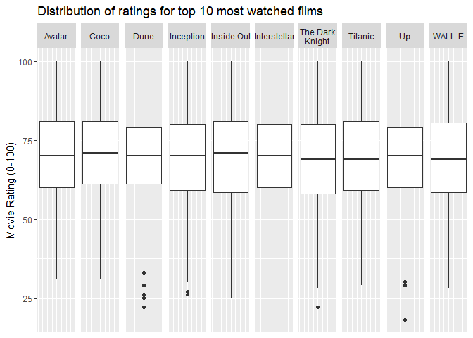

# Coursework 1: MA22019, Introduction to Data Science
Ewan Brett

<!--- DO NOT DELETE THIS LINE --->

<!--- METADATA ANCHOR: MA22019-CW1-2026 --->

Please read the `coursework_01_instructions.pdf` for the full context,
data dictionary, and detailed task requirements before starting.

``` r
library(tidyverse)
library(tidytext)
library(knitr)
```

## Part A: Data Wrangling & EDA

### Task 1: Data Joining

<!--- DO NOT DELETE THIS LINE - TASK 1 ANCHOR --->

``` r
# Write your Task 1 code here:
titles <- read_csv("data/titles.csv")
users <- read_csv("data/users.csv")
history <- read_csv("data/history.csv")

# cleaning the titles data
clean_titles <- distinct(titles)
dim(titles)[1] - dim(clean_titles)[1]
```

    [1] 10

``` r
# this has removed 10 duplicate rows

# cleaning the history data
clean_history <- distinct(history) %>% 
  mutate("watch_date"= gsub("/","-",watch_date))
dim(history)[1] - dim(clean_history)[1]
```

    [1] 311

``` r
# this has removed 311 duplicate rows

# joining the data
cinemetrics <- clean_history %>%
  left_join(clean_titles, by = "movie_id") %>%
  left_join(users, by = "user_id") %>% 
  mutate("watch_date" = as.Date(watch_date))

head(cinemetrics,10)
```

    # A tibble: 10 × 13
       user_id movie_id watch_date watch_duration_mins engagement_score
         <dbl>    <dbl> <date>                   <dbl>            <dbl>
     1     134       76 2025-03-22                 117               NA
     2    1353       25 2026-02-21                 103               65
     3    1367        1 2025-01-16                  15               24
     4    2154       16 2025-10-21                 130               74
     5     529       75 NA                          15               27
     6     201       50 2025-11-16                  52               41
     7     923       43 2026-02-22                  74               54
     8    2192       23 0012-04-25                  15               30
     9    2129       14 2025-04-11                 133               63
    10    2187       85 2025-11-06                  68               39
    # ℹ 8 more variables: user_rating_100 <dbl>, review_snippet <chr>,
    #   movie_title <chr>, release_year <dbl>, budget_usd <dbl>, genre_tags <chr>,
    #   age <dbl>, subscription_type <chr>

``` r
cinemetrics_messy <- history %>%
  left_join(titles, by = "movie_id") %>%
  left_join(users, by = "user_id")
```

    Warning in left_join(., titles, by = "movie_id"): Detected an unexpected many-to-many relationship between `x` and `y`.
    ℹ Row 14 of `x` matches multiple rows in `y`.
    ℹ Row 85 of `y` matches multiple rows in `x`.
    ℹ If a many-to-many relationship is expected, set `relationship =
      "many-to-many"` to silence this warning.

``` r
dim(cinemetrics)[1]
```

    [1] 19965

``` r
dim(cinemetrics_messy)[1]
```

    [1] 22558

<!--- WRITE YOUR WRITTEN ANSWER BELOW THIS LINE --->

#### Written Interpretation

*Removing duplicates in history was necessary because otherwise
duplicate rows would remain after the join, which would skew the
analysis of the variables. Performing the join without cleaning the data
first results in a dataset with 22558 rows, whereas with cleaned data we
have 19965 rows.*

### Task 2: Missing Values Handling

<!--- DO NOT DELETE THIS LINE - TASK 2 ANCHOR --->

``` r
# Write your Task 2 code here:

missing_summary <- cinemetrics %>% 
  is.na() %>% 
  colSums()

missing_summary %>% 
    kable(col.names = c("Variable", "Missing_Count"))
```

| Variable            | Missing_Count |
|:--------------------|--------------:|
| user_id             |             0 |
| movie_id            |             0 |
| watch_date          |          5110 |
| watch_duration_mins |           574 |
| engagement_score    |           582 |
| user_rating_100     |           985 |
| review_snippet      |          1939 |
| movie_title         |             0 |
| release_year        |             0 |
| budget_usd          |           980 |
| genre_tags          |             0 |
| age                 |            50 |
| subscription_type   |            50 |

``` r
cinemetrics$user_rating_100 %>% 
  median(na.rm = TRUE)
```

    [1] 71

``` r
cinemetrics$user_rating_100 %>% 
  replace_na(0) %>% 
  median()
```

    [1] 70

<!--- WRITE YOUR WRITTEN ANSWER BELOW THIS LINE --->

#### Written Interpretation

*summary() gives a general overview of the data, but may not account for
missing values, especially if the variable is a str or a factor. We
cannot be sure how it treats missing values, and calculates statistics
like the median. Hence it is much more reliable to use is.na() to
programmatically calculate the missing values in our data, and this
shows us that there are 985 for user_rating_100. That way we have the
freedom over how these are handled, e.g. whether you remove missing
values, or assign them a specific value, this can be decided based on
context of the data which summary() wouldn’t handle as effectively. For
example the median after removing the missing values of user_rating_100
is 71, however if we knew that users don’t bother rating films they
didn’t like, then it would make more sense to assign missing values as
0, giving us a median of 70. *

### Task 3: Genre Grouping

<!--- DO NOT DELETE THIS LINE - TASK 3 ANCHOR --->

``` r
# Write your Task 3 code here:

cinemetrics %>%
  count(genre_tags, sort = TRUE)
```

    # A tibble: 22 × 2
       genre_tags                      n
       <chr>                       <int>
     1 animated                     1667
     2 animation                    1633
     3 comedy, family               1516
     4 Science fiction              1480
     5 sci-fi, fantasy              1376
     6 comedy                       1369
     7 drama, emotional             1213
     8 drama, critically-acclaimed  1158
     9 scary                        1010
    10 rom-com                      1009
    # ℹ 12 more rows

``` r
unique(cinemetrics$genre_tags)
```

     [1] "animation"                   "comedy, family"             
     [3] "action"                      "Science fiction"            
     [5] "animated"                    "drama, emotional"           
     [7] "comedy"                      "sci-fi"                     
     [9] "drama, critically-acclaimed" "horror"                     
    [11] "romantic comedy"             "action, high-octane"        
    [13] "romantic"                    "rom-com"                    
    [15] "Drama"                       "sci-fi, fantasy"            
    [17] "terror"                      "scary"                      
    [19] "animation, kids"             "Romance"                    
    [21] "documentary, real-world"     "Documentary"                

``` r
cinemetrics <- cinemetrics %>% 
  mutate(primary_genre = fct_collapse(factor(genre_tags),
      "Animation" = c("animated", "animation", "animation, kids"),
      "Comedy" = c("comedy, family", "comedy"),
      "Sci-Fi" = c("sci-fi", "Science fiction", "sci-fi, fantasy"),
      "Action" = c("action","action, high-octane"),
      "Romance" = c("romantic comedy", "rom-com", "romantic", "Romance"),
      "Horror" = c("horror", "terror", "scary"),
      "Documentary" = c("documentary, real-world", "Documentary"),
      "Drama" = c("Drama", "drama, emotional", "drama, critically-acclaimed"),
      other_level = "Other"))


unique(cinemetrics$primary_genre)
```

    [1] Animation   Comedy      Action      Sci-Fi      Drama       Horror     
    [7] Romance     Documentary
    Levels: Action Animation Comedy Documentary Drama Horror Romance Sci-Fi

``` r
levels(cinemetrics$primary_genre)
```

    [1] "Action"      "Animation"   "Comedy"      "Documentary" "Drama"      
    [6] "Horror"      "Romance"     "Sci-Fi"     

``` r
cinemetrics %>%
  count(primary_genre, sort = TRUE) %>%
  kable()
```

| primary_genre |    n |
|:--------------|-----:|
| Animation     | 4207 |
| Sci-Fi        | 3543 |
| Drama         | 3307 |
| Comedy        | 2885 |
| Romance       | 2295 |
| Horror        | 1798 |
| Action        | 1585 |
| Documentary   |  345 |

``` r
# Write your verification code here:

cinemetrics %>%
  group_by(genre_tags) %>%
  summarise(
    avg_rating = mean(user_rating_100, na.rm = TRUE),  
    movie_count = n()) %>%
  arrange(desc(movie_count)) %>%
  filter(genre_tags %in% c("Romance", "romantic", "rom-com", "romantic comedy")) %>% 
  kable(caption = "Romance vs Rom-Com")
```

| genre_tags      | avg_rating | movie_count |
|:----------------|-----------:|------------:|
| rom-com         |   69.80269 |        1009 |
| Romance         |   69.82660 |         991 |
| romantic        |   69.04196 |         150 |
| romantic comedy |   66.35036 |         145 |

Romance vs Rom-Com

<!--- WRITE YOUR WRITTEN ANSWER BELOW THIS LINE --->

#### Written Interpretation

NEED TO CHANGE THIS:

\*When “romantic comedy” movies are collapsed into the “Romance”
category, the differences in ratings are lost. The “Romance” tag
contains 991 movies with an average rating of 69.83, while the “romantic
comedy” category is much smaller with only 145 movies and a
significantly lower average rating of 66.35. When these categories are
grouped together, the large number of higher-rated “Romance” films
dominates the average. As a result, the poorer performance of romantic
comedies is masked, creating a statistical distortion as the combined
category appears to perform better than the “romantic comedy” films
actually do.

This table shows us the original “genre_tags” has inconsistent labeling
which makes it unsuitable to perform proper analysis. We see there are
larger categories such as “rom-com” (1009 movies) and “romance” (991
movies), however we also have smaller categories representing the same
group but differently names, such as “romantic” (150) and “romantic
comedy” (145). Clearly “rom-com” and “romantic comedy” should be put in
the same group and “romance” and “romantic” should also be the same
group. However we then encounter a potential error which could effect
our analysis, as “romantic” is just an adjective, and potentially there
could be Rom-Coms in that category, which would be mislabeled if we kept
Rom-Com and Romance as seperate categories. Further, I found that when
we keep them as seperate categories, and group by the most frequent five
categories, “Other” becomes the largest category with 4225 entries. It
does not make sense to have such a large “Other” category when these can
be grouped into bigger categories with similar properties. When we group
them together, “Other” has only 2295 entries, hence we have more
insightful categories. Hence, I have decided grouping Rom-coms and
Romances as one category will be the best for our analysis, and allow
for better interpretability.\*

### Task 4: Genre Ratings Table

<!--- DO NOT DELETE THIS LINE - TASK 4 ANCHOR --->

``` r
# Write your Task 4 code here:
cinemetrics %>%
  group_by(primary_genre) %>%
  summarise(
    avg_rating = mean(user_rating_100, na.rm = TRUE),  
    movie_count = n()) %>%
  arrange(desc(avg_rating)) %>%
  kable(caption = "Average rating by Genre")
```

| primary_genre | avg_rating | movie_count |
|:--------------|-----------:|------------:|
| Horror        |   79.77719 |        1798 |
| Comedy        |   70.07359 |        2885 |
| Drama         |   69.83692 |        3307 |
| Documentary   |   69.73333 |         345 |
| Animation     |   69.69912 |        4207 |
| Sci-Fi        |   69.68587 |        3543 |
| Romance       |   69.54708 |        2295 |
| Action        |   69.21661 |        1585 |

Average rating by Genre

``` r
# Write your verification code here:
cinemetrics %>%
  group_by(primary_genre) %>%
  summarise(
    avg_rating = mean(user_rating_100, na.rm = TRUE), 
    avg_budget_USD = mean(budget_usd, na.rm = TRUE),
    movie_count = n()) %>%
  arrange(desc(avg_rating)) %>%
  filter(primary_genre %in% c("Horror", "Action", "Sci-Fi")) %>% 
  kable(caption = "Budget (USD) vs Average rating")
```

| primary_genre | avg_rating | avg_budget_USD | movie_count |
|:--------------|-----------:|---------------:|------------:|
| Horror        |   79.77719 |       10181094 |        1798 |
| Sci-Fi        |   69.68587 |      139588009 |        3543 |
| Action        |   69.21661 |      115543533 |        1585 |

Budget (USD) vs Average rating

``` r
cinemetrics %>% 
  filter(genre_tags %in% c("action", "action, high-octane")) %>% 
  group_by(genre_tags) %>% 
  summarise(avg_rating = mean(user_rating_100, na.rm = TRUE), 
    avg_budget_USD = mean(budget_usd, na.rm = TRUE),
    movie_count = n()) %>% 
  kable(caption = "Budget (USD) vs Average rating for Action subcategories")
```

| genre_tags          | avg_rating | avg_budget_USD | movie_count |
|:--------------------|-----------:|---------------:|------------:|
| action              |   69.35113 |      141788991 |         654 |
| action, high-octane |   69.12289 |       97106874 |         931 |

Budget (USD) vs Average rating for Action subcategories

<!--- WRITE YOUR WRITTEN ANSWER BELOW THIS LINE --->

#### Written Interpretation

\*From our data, there is evidence that larger budget does not
necessarily mean higher average rating. Our results show the highest
average rating was “Horror” with 79.78, however the average budget for
these movies was only approximately \$10.2m. We can see that on the
other hand, “Sci-Fi” and “Action” both had budgets of over \$100m, but
despite this they both had average ratings of roughly 69. This shows
that larger budget does not necessarily mean users preferred the movies.

“Action” is a very broad category and may hide valuable information
about differences in sub-genres. As there are many different smaller
subcategories of action films, by collapsing them into one large
category we lose the ability to compare performances of these
sub-genres, and the well-performing ones will be balanced out by the
poorly performing ones. In the case of this data, we have only collapsed
two sub-genres to make “action” and both of them have ratings of roughly
69, differing by only 0.3. Hence our grouping isn’t masking the
performance of any sub-genres in this case.

Sci-Fi has the largest budget (139588009USD), however it has the second
lowest average rating. We see here that Horror and Action are not part
of the top 5 categories, and therefore come under “Other”. The average
budget for “Other” (58846173USD) is roughly half of the Sci-Fi budget,
however the average ratings (74.35) are much higher. Hence larger budget
does not guarantee higher average rating. We can look at the unlumped
categories, which further reinforces this as Horror has by far the best
ratings (79.78), however has the smallest budget (10181094USD), and
Action has the lowest rating (69.22) and a much larger budget
(115543533USD). A very broad category like “Action” can mean that
performance of many different sub-categories balance out, so we cannot
really make good inferences from the data. For example, more niche
categories which don’t perform well won’t show in our inferences as they
will be averaged out by more successful subcategories within “Action”.\*

### Task 5: Ratings and Engagement Scores

<!--- DO NOT DELETE THIS LINE - TASK 5 ANCHOR --->

``` r
# Write your Task 5 code here:

cinemetrics %>% 
  summarise(missing_titles = sum(is.na(movie_title)))
```

    # A tibble: 1 × 1
      missing_titles
               <int>
    1              0

``` r
cinemetrics %>% 
  count(movie_title) %>% 
  arrange(n)
```

    # A tibble: 100 × 2
       movie_title                   n
       <chr>                     <int>
     1 Free Solo                    29
     2 My Octopus Teacher           30
     3 Summer of Soul               30
     4 The Act of Killing           33
     5 Won't You Be My Neighbor?    34
     6 Fire of Love                 36
     7 13th                         37
     8 Blackfish                    38
     9 Jiro Dreams of Sushi         39
    10 March of the Penguins        39
    # ℹ 90 more rows

``` r
cinemetrics %>% 
  count(movie_id) %>% 
  arrange(n)
```

    # A tibble: 100 × 2
       movie_id     n
          <dbl> <int>
     1       64    29
     2       65    30
     3       70    30
     4       68    33
     5       71    34
     6       69    36
     7       73    37
     8       72    38
     9       66    39
    10       67    39
    # ℹ 90 more rows

``` r
# we get the same output, so I can be sure there are no formatting errors leading to movies titles being grouped incorrectly

top10_watched_movies <- cinemetrics %>% 
  count(movie_title) %>% 
  arrange(desc(n)) %>% 
  slice_head(n=10)

most_watched_movies <- cinemetrics %>%
  filter(movie_title %in% top10_watched_movies$movie_title) %>% 
  mutate(movie_title = str_wrap(movie_title, width = 10), 
         movie_title = fct_reorder(movie_title, user_rating_100, .desc = TRUE, .na_rm = TRUE)) 
# GenAI used to find str_wrap function, in order to display the movie titles neater in my plot
  

most_watched_movies %>% 
  ggplot(aes(y= user_rating_100))+
  geom_boxplot()+
  facet_wrap(~ movie_title, nrow = 1)+
  labs(y = "Movie Rating (0-100)", title = "Distribution of ratings for top 10 most watched films")+
  theme(axis.ticks.x = element_blank(),
      axis.text.x = element_blank()) # GenAI used to find and understand the theme() function
```

    Warning: Removed 255 rows containing non-finite outside the scale range
    (`stat_boxplot()`).



<!--- WRITE YOUR WRITTEN ANSWER BELOW THIS LINE --->

#### Written Interpretation

*UP was the movie with the lowest outlier in ratings, at roughly 20/100,
meaning one user gave it a very bad rating. However for judging overall
audience opinion, we can discount this and look at the IQR. This is
relatively small compared to the others in top 10, hence there was less
variability in opinions and greater consensus among viewers’ ratings.*

``` r
# Write your verification code here:

most_watched_movies %>% 
  group_by(movie_title) %>% 
  summarise(IQR = IQR(user_rating_100, na.rm = TRUE)) %>% 
  arrange(desc(IQR))
```

    # A tibble: 10 × 2
       movie_title          IQR
       <fct>              <dbl>
     1 "Inside Out"        22.5
     2 "The Dark\nKnight"  22  
     3 "Titanic"           22  
     4 "WALL-E"            22  
     5 "Avatar"            21  
     6 "Inception"         21  
     7 "Coco"              20  
     8 "Interstellar"      20  
     9 "Up"                19  
    10 "Dune"              18  

#### Empirical Verification

*This supports my interpretation, as Up has the second lowest IQR of
19.0, meaning there was less variation in opinions. Inside out is the
film with least consensus in opinions with IQR of 22.5.*

### Task 6: Engagement Score and Subscription Type

<!--- DO NOT DELETE THIS LINE - TASK 6 ANCHOR --->

``` r
# Write your Task 6 code here:

cinemetrics %>% 
  filter(!is.na(subscription_type)) %>% 
  group_by(subscription_type) %>% 
  summarise(avg_engagement = mean(engagement_score, na.rm = TRUE)) %>% 
  arrange(desc(avg_engagement)) %>% 
  kable()
```

| subscription_type | avg_engagement |
|:------------------|---------------:|
| Premium           |       56.47616 |
| Basic             |       44.03936 |

``` r
age_quantiles <- quantile(cinemetrics$age, probs = c(0.25, 0.5, 0.75), na.rm = TRUE)

# gen AI was used to understand the probs argument in quantile()

age_quantiles %>% 
  kable(col.names = c("Quantile", "Value"), caption = "User age quantiles")
```

| Quantile | Value |
|:---------|------:|
| 25%      |    25 |
| 50%      |    35 |
| 75%      |    45 |

User age quantiles

``` r
cinemetrics <- cinemetrics %>% 
  mutate(age_tier = case_when(age <= age_quantiles[1] ~ "1",
                              age <= age_quantiles[2] ~ "2",
                              age <= age_quantiles[3] ~ "3",
                              age > age_quantiles[3]  ~ "4"))

avg_engagement <- cinemetrics %>% 
  filter(!is.na(subscription_type), !is.na(age_tier)) %>% 
  group_by(age_tier, subscription_type) %>% 
  summarise(
    avg_engagement = mean(engagement_score, na.rm = TRUE),
    .groups = "drop"
  ) %>% 
  arrange(desc(avg_engagement)) 

avg_engagement %>% 
  kable(caption = "Average Engagement by Age Tier and Subscription Type")
```

| age_tier | subscription_type | avg_engagement |
|:---------|:------------------|---------------:|
| 4        | Basic             |       80.10280 |
| 3        | Basic             |       74.33949 |
| 4        | Premium           |       68.76609 |
| 3        | Premium           |       55.09623 |
| 2        | Basic             |       50.92584 |
| 2        | Premium           |       38.23744 |
| 1        | Basic             |       28.93870 |
| 1        | Premium           |       12.66042 |

Average Engagement by Age Tier and Subscription Type

``` r
# Write your verification code here:

age_subtype_count <- cinemetrics %>% 
  filter(!is.na(subscription_type), !is.na(age_tier)) %>% 
  group_by(age_tier, subscription_type) %>% 
  summarise(total = n(), .groups = "drop") %>% 
  pivot_wider(names_from = subscription_type,
              values_from = total)
  
age_subtype_count %>% 
  kable(caption = "No. users per subscription type by age quartile")
```

| age_tier | Basic | Premium |
|:---------|------:|--------:|
| 1        |  4958 |     447 |
| 2        |  3523 |    1496 |
| 3        |   994 |    3762 |
| 4        |   557 |    4178 |

No. users per subscription type by age quartile

#### Empirical Verification

*For users 25 or younger, 91.0% use the basic subscription type. As age
increases, proportion of users with basic decreases. Only 13.3% users
over 45 have a basic subscription.*

<!--- WRITE YOUR WRITTEN ANSWER BELOW THIS LINE --->

#### Written Interpretation

*Our 2D analysis shows that engagement score for premium users (56.5) is
higher than that of basic users (44.0). However in our analysis split by
age category, basic users have higher engagement than premium for all
age categories. This change in observed trend is due to the differences
in group sizes and distribution of users. For instance, in this scenario
premium users are more highly concentrated in higher age categories (as
seen in verification), where engagement levels are higher generally,
hence the average engagement is weighted towards premium. *

------------------------------------------------------------------------

## Part B: Text Data Analysis

### Task 7: Tokenization & Word Frequency

<!--- DO NOT DELETE THIS LINE - TASK 7 ANCHOR --->

``` r
# Write your Task 7 code here:
```

<!--- WRITE YOUR WRITTEN ANSWER BELOW THIS LINE --->

#### Written Interpretation

*Replace this text with your explanation of why the top two words are
unhelpful for analysis.*

### Task 8: Sentiment Analysis

<!--- DO NOT DELETE THIS LINE - TASK 8 ANCHOR --->

``` r
# Write your Task 8 code here:
```

<!--- WRITE YOUR WRITTEN ANSWER BELOW THIS LINE --->

#### Written Interpretation

*Replace this text with your explanation of the scatterplot outlier.*

### Task 9: Advanced Text Mining (TF-IDF)

<!--- DO NOT DELETE THIS LINE - TASK 9 ANCHOR --->

``` r
# Write your Task 9 code here: 
```

<!--- WRITE YOUR WRITTEN ANSWER BELOW THIS LINE --->

#### Written Interpretation

1.  *Replace this text with the TF-IDF score for the word “film”.*
2.  *Replace this text with your mathematical explanation using the IDF
    equation from the lecture.*
3.  *Replace this text with your comparison of TF-IDF vs frequency.*

### Task 10: Executive Recommendation

<!--- DO NOT DELETE THIS LINE - TASK 10 ANCHOR --->

<!--- WRITE YOUR WRITTEN ANSWER BELOW THIS LINE --->

#### Written Interpretation

*Replace this text with your one-paragraph executive recommendation (max
150 words), citing at least three specific findings from earlier tasks
and acknowledging one limitation.*

------------------------------------------------------------------------

<!--- WORD COUNT ANCHOR --->

    **Prose Word Count:** 1164 words
